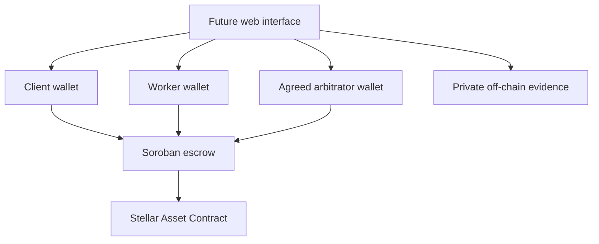

# MVP specification v0.1

## Product boundary

StellarWork coordinates one client, one worker, and one pre-agreed arbitrator for
1–20 independently funded milestones. It settles on-chain tokens, not fiat withdrawals.
Target users are remote contractors whose client can fund an agreed milestone before
work starts. Acceptance of work remains a human decision; an evidence URI does not
prove quality. Validate that users want this process before claiming product demand.

Single reviewed Stellar Asset Contract per deployment. No platform fee, arbitrator
bond, appeal process, token allowlist managed by an admin, upgrade function, savings
yield, DAO, or cross-chain routing. The original 'bonded arbitration' pitch must be
changed: the current MVP has agreed arbitration without bonds.

## Architecture

The interface requests signatures and displays confirmed state; it never chooses a
settlement split for the arbitrator or retains signing keys. An optional indexer is a
read model, never the authority for funds or milestone state. No indexer exists yet.

## State transitions

| Operation | From | To | Authorization | Time/other conditions |
| --- | --- | --- | --- | --- |
| create_engagement | none | Pending | client + worker + arbitrator | distinct parties; all due dates > now |
| fund_milestone | Pending | Funded | client | now <= due_at; exact agreed amount |
| submit_work | Funded | Submitted | worker | now <= due_at; evidence URI 1–512 UTF-8 bytes |
| approve_milestone | Submitted | Completed | client | 100% to worker |
| raise_dispute | Submitted | Disputed | client OR worker | no token movement |
| resolve_dispute | Disputed | Resolved | arbitrator | refund + payout = milestone amount |
| refund_expired | Funded | Refunded | client | now > due_at; 100% to client |

Every other transition fails. Completed, Resolved, and Refunded are terminal. Milestones
are zero-indexed. Engagement IDs start at zero and increase; no ID reuse or record deletion.
Work cannot be submitted late in this baseline. At the exact due timestamp funding and
submission are allowed and refund is denied. Ledger timestamps are seconds; TTL is ledgers.
Concurrent operations follow ledger order; the first valid terminal transition wins.

A worker with an unresponsive client may dispute submitted work immediately. A funded
milestone without a submission cannot be disputed; the worker must submit by its deadline.
A pending milestone that expires holds no money and cannot subsequently be funded.
There is no automatic approval window, deadline extension, partial funding, or resubmission.

## Public interface (Rust types)

| Method | Inputs after Env | Return |
| --- | --- | --- |
| __constructor | token: Address | () |
| create_engagement | client, freelancer, arbitrator: Address; terms_uri: String; terms: Vec<Terms> | Result<u64, Error> |
| fund_milestone | id: u64; mid: u32 | Result<(), Error> |
| submit_work | id: u64; mid: u32; uri: String | Result<(), Error> |
| approve_milestone | id: u64; mid: u32 | Result<(), Error> |
| raise_dispute | id: u64; mid: u32; actor: Address | Result<(), Error> |
| resolve_dispute | id: u64; mid: u32; refund, payout: i128 | Result<(), Error> |
| refund_expired | id: u64; mid: u32 | Result<(), Error> |
| get_engagement | id: u64 | Result<Engagement, Error> |
| get_milestone | id: u64; mid: u32 | Result<Milestone, Error> |
| get_locked | none | i128 |
| get_token | none | Address |
| keep_alive | id: u64 | Result<(), Error> |

Terms = amount:i128, due_at:u64. Engagement = client, freelancer, arbitrator, terms_uri,
count. Milestone = amount, due_at, status, evidence_uri. Terms URI is an immutable
reference to agreed scope, acceptance criteria, dates, and arbitration policy. All three
parties authorize the same create invocation including all parameters. Asynchronous
collection of those authorizations is a known future interface requirement.

Errors: 1 NotFound, 2 InvalidTerms, 3 InvalidState, 4 WrongParty, 5 Deadline,
6 InvalidUri, 7 InvalidSplit, 8 Overflow. Signature/token/host failures may surface as
host errors rather than these contract errors. URI bounds do not validate URL schemes,
content integrity, availability, or safety. Treat references as untrusted in the frontend.

## Accounting invariants

- Locked liability equals sum of amounts in Funded, Submitted, or Disputed states.
- Contract token balance >= locked liability. Unsolicited donations may make it greater.
- No path releases more than a funded milestone's amount; each settles at most once.
- Settlement uses nonnegative integer base units and exact sum; no fractional rounding.
- Aggregated amounts and IDs use checked arithmetic. Never convert amounts via float.
- State/accounting and token transfers must commit or revert together on Soroban.
- A settlement for one milestone does not alter another engagement or milestone.
- No admin or arbitrator can withdraw unrelated balances; no surplus withdrawal exists.

Python tests establish business invariants in a model, not proof of these on-chain
properties. The SDK integration must separately verify auth, rollback, token behavior,
TTL, emitted events, and archive restoration.

## Storage, retention, and events

Token, ID counter, and aggregate liability use instance storage. Engagement headers and
individual milestone records use separate persistent keys. Temporary storage never
contains financial obligations. Routine interactions extend touched entry TTLs; keep_alive
extends every milestone in one engagement. Values are 17,280 ledger threshold and 518,400
ledger extension target, initially experimental and subject to network-limit validation.
A getter's extension only persists when submitted on-chain, not when merely simulated.
Dormant archived state requires explicit restoration through the RPC workflow.

Events: created(id) -> count; funded(id,mid) -> amount; submitted(id,mid) -> evidence_uri;
disputed(id,mid) -> actor; settled(id,mid) -> (refund,payout,terminal_status).
Index keys are draft until native event tests and generated bindings establish the ABI.

## Trust and failure modes

The arbitrator can make an unfair decision and can become unavailable; there is no
on-chain proof of work quality, appeal, replacement, or default arbitration fallback.
The present design can lock disputed funds indefinitely. Joint client/worker settlement
is the preferred proposed extension, but cannot resolve a dispute when they disagree.
Maintainers must decide the remaining liveness policy before an external payment pilot.

Issuer authorization, freeze/clawback, revoked trustlines, or recipient restrictions
may prevent transfers. Arbitrary token contract behavior and fee-on-transfer tokens
are unsupported. Network deployment metadata must identify a verified SAC address;
passing an address into the constructor alone does not establish that it is a safe token.
A private evidence service can disappear or leak documents. Lost keys block required
signatures. Testnet resets invalidate deployment state. Notification delivery does not
change contractual deadlines. There is no real-money deployment in this bundle.
